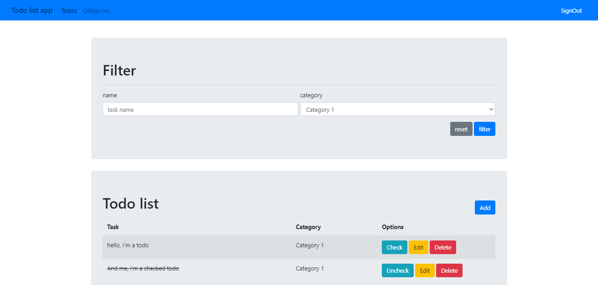

# Express and Mongoose

## Installation

Clone this repo and install packages with `npm` or `yarn`

```bash
$ npm install
```

You will need run a Mongodb server and set up database configuration. Check the [config file](./config/database.json).

To run the app in development mode with

```bash
$ npm run start:dev
```

or in production mode with

```bash
$ npm start
```

## App Screen



